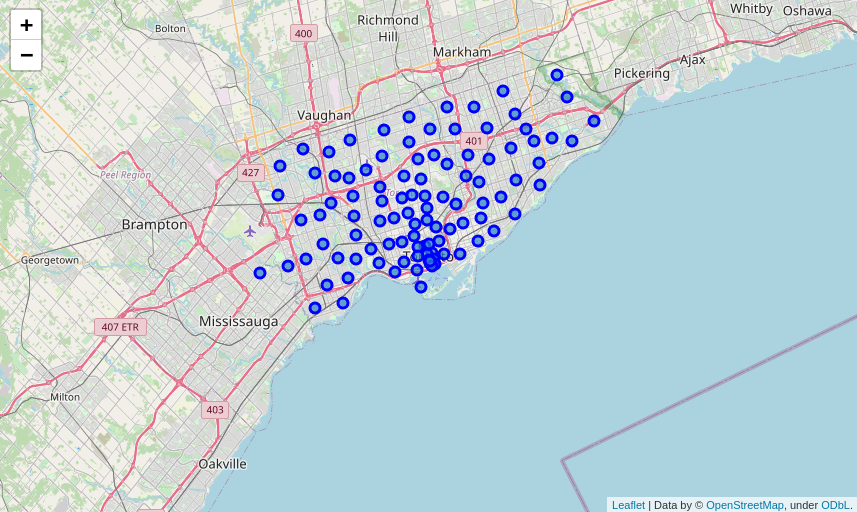
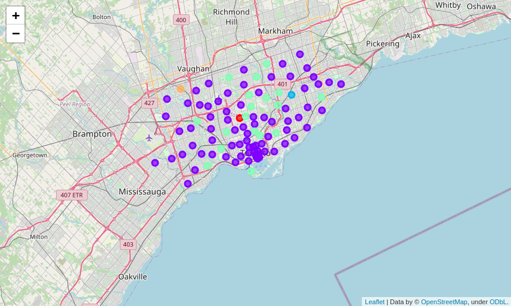

# IBM Capstone Project

## Goal of this capstone project: 

Use location data in order to compare Toronto's neighborhoods and cluster them into 5 distinct groups.

To do that, we will have to :
- Use location data and different location data providers, such as Foursquare.
- Make RESTful API calls to the Foursquare API to retrieve data about venues in different neighborhoods around the world.
- Be creative in situations where data are not readily available by scraping web data and parsing HTML code.
- Make use of Folium library to generate maps of geospatial data and to communicate results and findings.

## Table of contents

  
1. [Retrieve the data from Wikipedia page]
2. [Data Wrangling]
3. [Exploration of the neighborhoods in Toronto]
4. [Analysis of Each Neighborhood]
5. [Cluster Neighborhoods]
6. [Examine Clusters]

## Results

